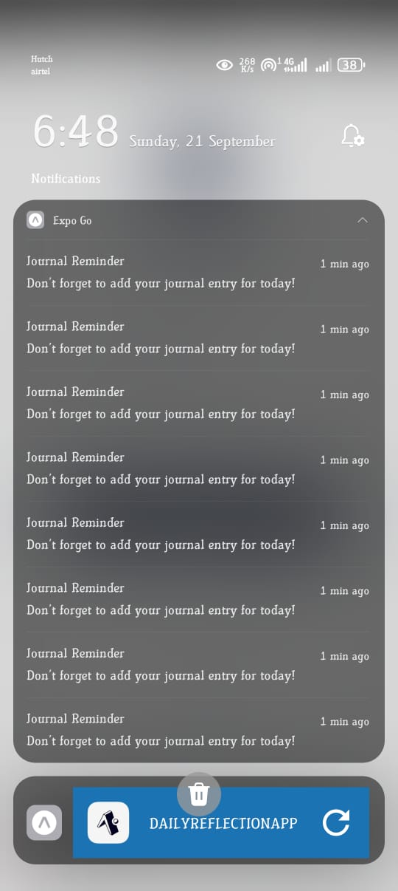

```markdown
# 🌟 DailyReflectionApp

A cross-platform mobile application built with **React Native (Expo)** that helps you reflect on your daily experiences, manage notes, and track personal growth.  

---

## 🚀 Features

* 📓 Daily reflections journaling  
* 🔐 User authentication (login & signup)  
* ☁️ Data persistence with backend integration  
* 🎨 Dark/Light theme support  
* 🛎️ Daily notification reminders  
* ⚡ Smooth and responsive UI  

---

## 🛠️ Tech Stack

* [React Native](https://reactnative.dev/) (Expo)  
* [Expo Router](https://expo.github.io/router/)  
* Context API for state management  
* Firebase / Supabase (for authentication & storage) 

---

---

## ⚙️ Installation & Setup

### Prerequisites

* Node.js (>= 18.x)  
* Expo CLI (`npm install -g expo-cli`)  
* Git  

### Steps

1. Clone the repository:

   ```bash
   git clone https://github.com/lihiniapsara/DailyReflectionApp.git
   cd DailyReflectionApp
````

2. Install dependencies:

   ```bash
   npm install
   # or
   yarn install
   ```

3. Start the development server:

   ```bash
   npx expo start
   ```

4. Run on device/emulator:

   * Scan QR code in **Expo Go** app (iOS/Android)
   * Or press `a` for Android Emulator / `i` for iOS Simulator

---

## 📱 Screenshots

### Journal Reminder Notification

Here’s a preview of the notification reminder feature:



---

## 📦 Download APK

👉 [Download DailyReflectionApp APK](./release/DailyReflectionApp.apk)


---

## 🎥 Demo Video

Watch the demo of **DailyReflectionApp** on YouTube:  

[](https://youtu.be/CFrTsumugq4?si=6sUzW7uFeyKkFHL3)

---

## 🧪 Running Tests

```bash
npm test
```

---

## 📦 Build for Production

```bash
npx expo build:android
npx expo build:ios
```

---

## 🤝 Contributing

1. Fork the repo
2. Create a feature branch (`git checkout -b feature-name`)
3. Commit changes (`git commit -m "Add new feature"`)
4. Push to branch (`git push origin feature-name`)
5. Create a Pull Request

---

## 📜 License

This project is licensed under the MIT License – feel free to use and modify as needed.

---

✨ *Start your journey of self-reflection today with DailyReflectionApp!*


 

